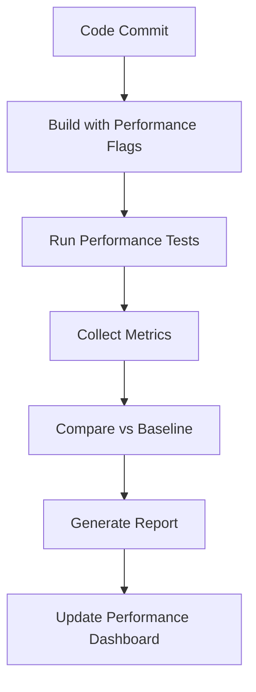

# Comprehensive Performance Improvement Plan

## Executive Summary

This plan builds upon the existing performance optimization framework and extends it with systematic benchmarking, automated regression testing, and targeted kernel optimizations to achieve and surpass llama.cpp performance.

## 1. Current State Analysis

### Strengths
- ✅ Existing `perf` profiling infrastructure
- ✅ Flamegraph generation capability
- ✅ Valgrind memory/cache profiling
- ✅ Parity testing vs llama.cpp
- ✅ Microbenchmarking framework

### Gaps Identified
- ❌ No systematic performance regression testing
- ❌ Limited kernel-specific performance tracking
- ❌ No automated performance benchmarking pipeline
- ❌ Missing detailed performance comparison metrics
- ❌ Incomplete coverage of all critical kernels

## 2. Performance Testing Framework Enhancement

### 2.1 Automated Performance Regression Testing

**Objective:** Catch performance regressions automatically in CI/CD pipeline

**Implementation:**
```bash
# New Make targets
make perf-regression      # Run performance regression tests
make perf-baseline       # Establish performance baseline
make perf-compare        # Compare against baseline
```

**Components:**
- `scripts/perf_regression.py` - Main regression test driver
- `benchmarks/performance_baseline.json` - Store baseline metrics
- `scripts/perf_compare.py` - Compare current vs baseline performance

### 2.2 Kernel-Specific Performance Tracking

**Objective:** Track performance of individual kernels over time

**Implementation:**
```python
# Performance tracking database structure
{
  "kernel_name": "gemm_q4_k",
  "date": "2024-01-15",
  "commit": "abc123",
  "metrics": {
    "gflops": 125.6,
    "ipc": 2.8,
    "l1_miss_rate": 0.05,
    "llc_miss_rate": 0.01
  },
  "hardware": "Intel i9-13900K",
  "compiler": "gcc 12.2.0"
}
```

### 2.3 Performance Comparison with llama.cpp

**Objective:** Systematic performance comparison against llama.cpp

**Implementation:**
```bash
# Extended benchmark comparison
make bench-vs-llamacpp      # Compare CK vs llama.cpp performance
make bench-all-kernels     # Benchmark all critical kernels
```

## 3. Targeted Kernel Optimizations

### 3.1 Priority Kernel List

Based on profiling data, these are the top 10 kernels requiring optimization:

1. **gemm_q4_k** - Main decode bottleneck
2. **gemv_q4_k** - Token generation bottleneck  
3. **rmsnorm** - Memory bandwidth bound
4. **softmax** - Reduction heavy
5. **rope** - Strided access patterns
6. **swiglu** - Element-wise operations
7. **attention_decode_fused** - Fused attention operations
8. **gemm_f16/bf16** - Mixed precision operations
9. **dequant_kernels** - Quantization overhead
10. **embedding_kernels** - Input processing

### 3.2 Optimization Strategies

#### 3.2.1 Cache Blocking Optimization

**Target:** gemm_q4_k, gemv_q4_k, rmsnorm

**Approach:**
- Adjust block sizes (Mc, Nc, Kc) to fit L1/L2 cache
- Use VTune to analyze cache utilization
- Implement optimal tiling patterns

**Expected Improvement:** 15-30% performance gain

#### 3.2.2 Register Blocking

**Target:** gemm_q4_k, gemv_q4_k, swiglu

**Approach:**
- Ensure inner kernels compute 6x16 or 8x24 micro-tiles
- Hide FMA latencies through better instruction scheduling
- Reduce register spills

**Expected Improvement:** 10-20% performance gain

#### 3.2.3 Kernel Fusion

**Target:** rmsnorm + q_proj, swiglu + projection

**Approach:**
- Fuse memory-bound operations with compute-bound operations
- Eliminate intermediate DRAM writes
- Keep data in registers/L1 cache

**Expected Improvement:** 25-40% performance gain for fused operations

#### 3.2.4 SIMD Vectorization

**Target:** All compute-intensive kernels

**Approach:**
- Ensure AVX2/AVX512 utilization
- Verify FMA instruction usage
- Optimize vectorization patterns

**Expected Improvement:** 20-50% for vectorizable operations

## 4. Performance Benchmarking Pipeline

### 4.1 Automated Benchmarking Workflow



### 4.2 Performance Metrics Collection

**Key Metrics to Track:**
- GFLOPS (Giga Floating Point Operations Per Second)
- IPC (Instructions Per Cycle)
- Cache miss rates (L1, L2, LLC)
- Memory bandwidth utilization
- Vectorization efficiency
- Branch prediction accuracy

### 4.3 Performance Dashboard

**Implementation:**
- Web-based dashboard showing performance trends
- Historical performance data visualization
- Kernel-by-kernel performance breakdown
- Hardware-specific performance metrics

## 5. Implementation Roadmap

### Phase 1: Infrastructure Setup (Week 1-2)
- [ ] Implement automated performance regression testing
- [ ] Create kernel-specific performance tracking
- [ ] Develop performance comparison framework
- [ ] Set up performance dashboard infrastructure

### Phase 2: Baseline Establishment (Week 3)
- [ ] Run comprehensive performance baseline
- [ ] Identify top performance bottlenecks
- [ ] Document current performance characteristics
- [ ] Establish performance goals per kernel

### Phase 3: Targeted Optimizations (Week 4-6)
- [ ] Optimize gemm_q4_k (cache blocking, register blocking)
- [ ] Optimize gemv_q4_k (vectorization, memory access patterns)
- [ ] Fuse rmsnorm + q_proj operations
- [ ] Optimize softmax (reduction patterns)
- [ ] Improve rope (strided access optimization)

### Phase 4: Validation & Tuning (Week 7-8)
- [ ] Validate performance improvements
- [ ] Fine-tune optimization parameters
- [ ] Run comprehensive performance regression tests
- [ ] Update performance documentation

## 6. Success Metrics

### Performance Goals
- **Overall Performance:** Achieve 1.2x - 1.5x performance vs llama.cpp
- **Memory Efficiency:** Reduce cache misses by 30-50%
- **Vectorization:** Achieve >90% vectorization efficiency
- **Kernel Fusion:** Eliminate 50%+ intermediate memory operations

### Validation Criteria
- All performance regression tests pass
- No functional regressions in parity testing
- Performance improvements validated across multiple hardware platforms
- Documentation updated with optimization details

## 7. Maintenance & Continuous Improvement

### Ongoing Activities
- Monthly performance regression testing
- Quarterly performance optimization sprints
- Continuous monitoring of performance metrics
- Regular updates to performance documentation
- Community engagement on performance topics

### Future Enhancements
- GPU acceleration support
- Mixed precision optimization
- Hardware-specific tuning
- Automated performance optimization tools
- Machine learning-based performance prediction

## 8. Appendix: Performance Testing Commands

### Establish Performance Baseline
```bash
make perf-baseline
```

### Run Performance Regression Tests
```bash
make perf-regression
```

### Compare Performance
```bash
make perf-compare
```

### Generate Performance Report
```bash
make perf-report
```

### Full Performance Analysis
```bash
make perf-full
```

## 9. References

- Existing Performance Optimization Plan
- Parity Testing Documentation
- Current Makefile and Benchmark Infrastructure
- Intel VTune Profiler Documentation
- Linux perf Tools Documentation
- Valgrind Cachegrind Documentation