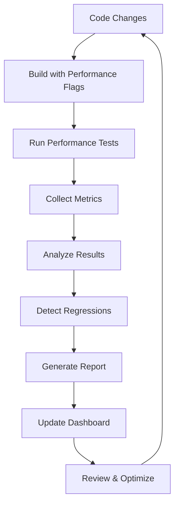

# Performance Testing Methodology

## 1. Introduction

This document outlines the comprehensive performance testing methodology for C-Kernel-Engine, designed to ensure systematic performance evaluation, regression detection, and continuous improvement.

## 2. Performance Testing Principles

### 2.1 Measurement-Driven Development
- **Principle:** "Measure, don't guess"
- **Approach:** Use hardware counters and profiling tools to identify bottlenecks
- **Tools:** `perf`, VTune, Valgrind, flamegraphs

### 2.2 Reproducible Benchmarking
- **Principle:** Consistent, reproducible performance measurements
- **Approach:** Standardized test conditions, fixed random seeds, controlled environments
- **Implementation:** Automated test harnesses with environment control

### 2.3 Comprehensive Coverage
- **Principle:** Test all critical performance paths
- **Approach:** Kernel-level, layer-level, and end-to-end performance testing
- **Coverage:** All major kernels, common execution patterns, edge cases

## 3. Performance Testing Framework

### 3.1 Test Environment Setup

#### Hardware Requirements
- **CPU:** x86_64 with AVX2/AVX512 support
- **Memory:** 16GB+ RAM
- **Storage:** SSD for consistent I/O performance
- **OS:** Linux with perf_event support

#### Software Requirements
- **Compiler:** GCC 11+ or Clang 14+
- **Tools:** perf, Valgrind, VTune (optional)
- **Python:** 3.8+ for test automation
- **Dependencies:** NumPy, pandas for data analysis

### 3.2 Test Configuration

```yaml
# Example test configuration
test_config:
  iterations: 100
  warmup_iterations: 10
  matrix_sizes: [256, 512, 1024, 2048]
  batch_sizes: [1, 4, 8, 16]
  precision_modes: ["fp32", "fp16", "bf16", "q4_k"]
  tolerance: 1e-5
```

## 4. Performance Test Types

### 4.1 Microbenchmarking

**Purpose:** Test individual kernel performance in isolation

**Implementation:**
```bash
# Run microbenchmarks
make microbench-kernels
make microbench-gemm
make microbench-attention
```

**Metrics Collected:**
- Execution time (ms)
- GFLOPS
- Instructions per cycle (IPC)
- Cache miss rates
- Branch prediction accuracy

### 4.2 Kernel-Level Performance Testing

**Purpose:** Test individual kernel performance with realistic inputs

**Implementation:**
```bash
# Test specific kernel performance
make perf-test-gemm_q4k
make perf-test-rmsnorm
make perf-test-swiglu
```

**Test Parameters:**
- Input sizes: Small, medium, large
- Data types: FP32, FP16, BF16, quantized
- Batch sizes: 1, 4, 8, 16
- Thread counts: 1, 2, 4, 8

### 4.3 Layer-Level Performance Testing

**Purpose:** Test complete layer performance (multiple kernels)

**Implementation:**
```bash
# Test layer performance
make perf-test-attention-layer
make perf-test-mlp-layer
make perf-test-transformer-layer
```

**Test Parameters:**
- Sequence lengths: 64, 128, 256, 512
- Hidden dimensions: 256, 512, 1024, 2048
- Number of heads: 4, 8, 16, 32
- Batch sizes: 1, 4, 8

### 4.4 End-to-End Performance Testing

**Purpose:** Test complete model inference performance

**Implementation:**
```bash
# Test end-to-end performance
make perf-test-model-inference
make perf-test-token-generation
```

**Test Parameters:**
- Model sizes: Small (100M), medium (500M), large (2B+)
- Sequence lengths: 64, 128, 256, 512, 1024
- Batch sizes: 1, 4, 8
- Precision modes: FP32, FP16, BF16, quantized

## 5. Performance Regression Testing

### 5.1 Baseline Establishment

**Process:**
1. Run comprehensive performance tests
2. Record baseline metrics
3. Store in performance database
4. Tag with commit hash and timestamp

**Command:**
```bash
make perf-baseline
```

### 5.2 Regression Detection

**Process:**
1. Run current performance tests
2. Compare against baseline
3. Flag significant regressions (>5% performance drop)
4. Generate regression report

**Command:**
```bash
make perf-regression
```

### 5.3 Regression Analysis

**Approach:**
- Identify regressed kernels
- Analyze performance characteristics
- Compare assembly output
- Check for algorithmic changes
- Verify hardware counter differences

## 6. Performance Comparison Methodology

### 6.1 Comparison with llama.cpp

**Approach:**
- Run identical workloads on both engines
- Compare execution times
- Analyze performance characteristics
- Identify optimization opportunities

**Command:**
```bash
make bench-vs-llamacpp
```

### 6.2 Cross-Platform Comparison

**Approach:**
- Test on multiple CPU architectures
- Compare performance characteristics
- Identify architecture-specific optimizations
- Document platform-specific behavior

### 6.3 Historical Performance Tracking

**Approach:**
- Maintain performance history database
- Track performance trends over time
- Identify performance improvements/regressions
- Generate performance trend reports

## 7. Performance Profiling Techniques

### 7.1 CPU Profiling with perf

**Basic Profiling:**
```bash
perf stat -e cycles,instructions,cache-references,cache-misses,L1-dcache-loads,L1-dcache-load-misses,LLC-loads,LLC-load-misses ./benchmark
```

**Detailed Profiling:**
```bash
perf record -g -F 99 ./benchmark
perf report -i perf.data
```

**Flamegraph Generation:**
```bash
perf script | stackcollapse-perf.pl | flamegraph.pl > flamegraph.svg
```

### 7.2 Memory Profiling with Valgrind

**Cache Profiling:**
```bash
valgrind --tool=cachegrind --cachegrind-out-file=cachegrind.out ./benchmark
cg_annotate cachegrind.out
```

**Heap Profiling:**
```bash
valgrind --tool=massif --pages-as-heap=yes --massif-out-file=massif.out ./benchmark
ms_print massif.out
```

### 7.3 Advanced Profiling with VTune

**Hotspot Analysis:**
```bash
vtune -collect hotspots -result-dir vtune_hotspots ./benchmark
```

**Memory Access Analysis:**
```bash
vtune -collect memory-access -result-dir vtune_memory ./benchmark
```

**Microarchitecture Analysis:**
```bash
vtune -collect uarch-exploration -result-dir vtune_uarch ./benchmark
```

## 8. Performance Test Automation

### 8.1 Automated Test Execution

**Implementation:**
```python
# Example automated test runner
def run_performance_tests():
    kernels = get_kernel_list()
    results = {}
    
    for kernel in kernels:
        result = run_kernel_test(kernel)
        results[kernel] = result
        save_results(result)
    
    return results
```

### 8.2 Continuous Integration

**CI Pipeline:**
```yaml
# Example CI configuration
jobs:
  performance_test:
    runs-on: ubuntu-latest
    steps:
      - uses: actions/checkout@v2
      - name: Build
        run: make build-perf
      - name: Run Performance Tests
        run: make perf-regression
      - name: Upload Results
        uses: actions/upload-artifact@v2
        with:
          name: performance-results
          path: perf_results/
```

### 8.3 Performance Dashboard

**Implementation:**
- Web-based dashboard showing performance metrics
- Historical performance trends
- Kernel-by-kernel breakdown
- Hardware-specific performance data
- Regression alerts and notifications

## 9. Performance Test Validation

### 9.1 Result Validation

**Approach:**
- Statistical analysis of performance data
- Outlier detection and removal
- Confidence interval calculation
- Significance testing

### 9.2 Cross-Validation

**Approach:**
- Test on multiple hardware platforms
- Validate with different compilers
- Test with various optimization levels
- Verify with different input data

### 9.3 Regression Validation

**Approach:**
- Confirm regressions are real (not measurement noise)
- Identify root cause of regressions
- Develop fixes for regressions
- Verify fixes resolve the issue

## 10. Performance Reporting

### 10.1 Performance Report Structure

```markdown
# Performance Report - [Date]

## Executive Summary
- Overall performance: [X] GFLOPS
- Improvement vs baseline: [Y]%
- Regressions detected: [Z]

## Detailed Results

### Kernel Performance
| Kernel | GFLOPS | IPC | L1 Miss Rate | Improvement |
|--------|--------|-----|--------------|-------------|
| gemm_q4_k | 125.6 | 2.8 | 0.05 | +15% |
| rmsnorm | 89.2 | 2.1 | 0.12 | +8% |

### Regression Analysis
| Kernel | Metric | Baseline | Current | Change | Status |
|--------|--------|----------|---------|--------|--------|
| swiglu | GFLOPS | 98.4 | 93.1 | -5.4% | REGRESSION |

### Recommendations
- Investigate swiglu performance regression
- Optimize cache blocking for gemm_q4_k
- Improve vectorization for rmsnorm
```

### 10.2 Performance Report Generation

**Command:**
```bash
make perf-report
```

**Output:**
- HTML performance dashboard
- JSON performance metrics
- CSV data for analysis
- Markdown summary report

## 11. Performance Testing Best Practices

### 11.1 Test Environment
- Use consistent hardware for comparisons
- Disable power saving features
- Set CPU governor to performance mode
- Minimize background processes
- Use identical compiler versions

### 11.2 Test Execution
- Run multiple iterations for statistical significance
- Include warmup runs to account for caching effects
- Use fixed random seeds for reproducibility
- Test with realistic input sizes and distributions
- Document all test parameters and conditions

### 11.3 Result Analysis
- Look for consistent patterns across multiple runs
- Investigate outliers and anomalies
- Compare against historical data
- Validate with multiple profiling tools
- Document findings and recommendations

## 12. Performance Testing Tools

### 12.1 Core Tools
- **perf:** Linux performance counters
- **Valgrind:** Memory and cache profiling
- **VTune:** Advanced microarchitecture analysis
- **FlameGraph:** Visualization of performance data

### 12.2 Supporting Tools
- **Python:** Test automation and data analysis
- **NumPy/pandas:** Performance data processing
- **Matplotlib:** Performance visualization
- **Jupyter:** Interactive performance analysis

### 12.3 Custom Tools
- **perf_regression.py:** Performance regression detection
- **perf_compare.py:** Performance comparison
- **perf_report.py:** Performance report generation
- **kernel_analyzer.py:** Kernel-specific analysis

## 13. Performance Testing Workflow



## 14. Performance Testing Commands

### Basic Performance Testing
```bash
make perf-test              # Run basic performance tests
make perf-full              # Run comprehensive performance tests
make perf-quick             # Run quick performance tests
```

### Kernel-Specific Testing
```bash
make perf-test-gemm_q4k     # Test gemm_q4_k performance
make perf-test-rmsnorm      # Test rmsnorm performance
make perf-test-swiglu       # Test swiglu performance
```

### Regression Testing
```bash
make perf-baseline          # Establish performance baseline
make perf-regression        # Run performance regression tests
make perf-compare           # Compare current vs baseline
```

### Advanced Profiling
```bash
make profile-cpu            # CPU profiling with perf
make profile-cache          # Cache profiling with Valgrind
make flamegraph             # Generate flamegraph
make profile-memory         # Memory profiling
```

### Reporting
```bash
make perf-report            # Generate performance report
make perf-dashboard         # Generate performance dashboard
make perf-history           # Show performance history
```

## 15. Performance Testing Maintenance

### Regular Activities
- Weekly performance regression testing
- Monthly comprehensive performance testing
- Quarterly performance optimization review
- Annual performance goals setting

### Continuous Improvement
- Regular toolchain updates
- New hardware testing
- Algorithm improvements
- Community benchmark contributions
- Performance documentation updates

## 16. Troubleshooting

### Common Issues
- **Performance variability:** Ensure consistent test environment
- **Missing metrics:** Verify profiling tools are installed
- **Regression false positives:** Check statistical significance
- **Tool compatibility:** Use supported tool versions

### Debugging Tips
- Start with simple tests, then complex
- Verify test environment consistency
- Check for background processes
- Validate hardware performance state
- Review profiling tool output carefully

## 17. Performance Testing Resources

### Documentation
- Performance Optimization Plan
- Performance Improvement Plan
- Parity Testing Documentation
- Kernel Development Guide

### External Resources
- Intel VTune Documentation
- Linux perf Wiki
- Valgrind User Manual
- FlameGraph Documentation
- Performance Analysis Guides

## 18. Performance Testing Glossary

**GFLOPS:** Giga Floating Point Operations Per Second
**IPC:** Instructions Per Cycle
**L1/L2/LLC:** Cache levels (L1, L2, Last Level Cache)
**FMA:** Fused Multiply-Add
**AVX:** Advanced Vector Extensions
**SIMD:** Single Instruction Multiple Data
**DRAM:** Dynamic Random Access Memory
**TLB:** Translation Lookaside Buffer
**IPC:** Instructions Per Cycle
**CPI:** Cycles Per Instruction
**DTLB:** Data Translation Lookaside Buffer
**ITLB:** Instruction Translation Lookaside Buffer