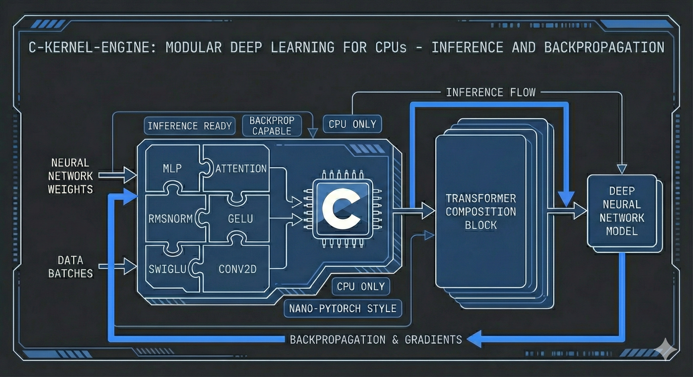
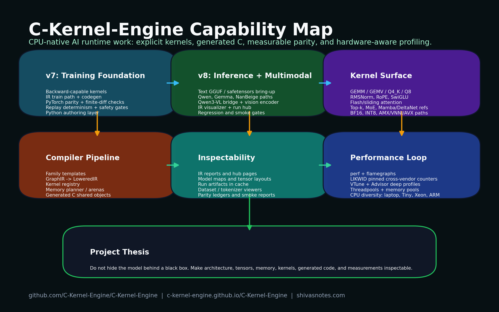

# C-Kernel-Engine



[](https://github.com/C-Kernel-Engine/C-Kernel-Engine/actions/workflows/nightly.yml)
[](https://github.com/C-Kernel-Engine/C-Kernel-Engine/actions/workflows/llamacpp-rolling-compat.yml)
[](https://github.com/C-Kernel-Engine/C-Kernel-Engine/actions/workflows/docs.yml)

C-Kernel-Engine (CKE) is a C-first compiler, kernel library, and runtime for transformer inference and training on CPUs. It turns model weights, explicit circuits, and kernel capability maps into inspectable generated C rather than hiding execution behind a general-purpose framework.

New to the project? Start with [What Is the C Kernel Engine?](https://www.shivasnotes.com/blog/5889/What-Is-the-C-Kernel-Engine), then use this README as the map from the ideas to the [documentation](https://c-kernel-engine.github.io/C-Kernel-Engine/) and [source code](https://github.com/C-Kernel-Engine/C-Kernel-Engine).

The project is built around a practical thesis:

> A CPU AI system becomes competitive by making the complete model circuit explicit, proving its numerical behavior, and methodically moving every important stage toward the hardware roofline.

CKE is not only a collection of fast GEMMs. It is an attempt to connect model architecture, numerical semantics, code generation, memory planning, threading, parity testing, and profiler evidence into one reproducible system.



The diagram is generated by [`tools/generate_cke_capability_map.py`](tools/generate_cke_capability_map.py) so its project and profiling surface can evolve with the repository.

## Start Here

Linux is the supported development and profiling environment. The command below
downloads a small GGUF on first use, converts it to BUMP, lowers the selected
circuit and kernel capabilities, compiles generated C, and starts text inference:

```bash
git clone --recurse-submodules https://github.com/C-Kernel-Engine/C-Kernel-Engine.git
cd C-Kernel-Engine

./scripts/setup-dev-env.sh
version/v8/scripts/cks-v8-run run \
  hf://unsloth/gemma-3-270m-it-GGUF/gemma-3-270m-it-Q5_K_M.gguf \
  --context-len 1024 \
  --prompt 'Explain why numerical reduction order matters.' \
  --max-tokens 256 \
  --generate-visualizer
```

Use the same command with a local GGUF path or another supported Hugging Face
artifact. For inference, follow the
[v8 runbook](https://c-kernel-engine.github.io/C-Kernel-Engine/v8-runbook.html),
which contains the model-specific text, high-memory safetensors, multimodal,
long-context, and overnight commands. Running the compiler and contract test
suites is not required to start using a supported model.

For an AI coding agent, this two-sentence prompt is sufficient:

> Read the CKE v8 runbook and use its documented command to run `<model>` for inference. Report the exact command, artifact, quantization, context length, detected ISA, and observed prefill/decode throughput; do not claim support beyond the evidence linked by the runbook.

### Run More Models Now

Text models use the same generated-runtime entry point. Replace `MODEL` with a
public `hf://` artifact from the table or a local GGUF/safetensors directory:

```bash
version/v8/scripts/cks-v8-run run MODEL \
  --context-len 2048 \
  --prompt 'Give me a concise example of safe C code.' \
  --max-tokens 256
```

| Model lane | Artifact or command | Required or recommended options |
|---|---|---|
| Gemma3 270M IT | `hf://unsloth/gemma-3-270m-it-GGUF/gemma-3-270m-it-Q5_K_M.gguf` | `--chat-template auto` |
| **Gemma4 E4B IT** | `hf://unsloth/gemma-4-E4B-it-GGUF/gemma-4-E4B-it-Q4_K_M.gguf` | `--chat-template gemma4 --temperature 0.0`; use `--max-tokens 1024` for a long coherence smoke |
| Qwen2 0.5B Instruct | `hf://Qwen/Qwen2-0.5B-Instruct-GGUF/qwen2-0_5b-instruct-q4_k_m.gguf` | `--chat-template auto` |
| Qwen3 0.6B | `hf://Qwen/Qwen3-0.6B-GGUF/Qwen3-0.6B-Q8_0.gguf` | `--chat-template auto` |
| Qwen3.5 0.8B | `hf://unsloth/Qwen3.5-0.8B-GGUF/Qwen3.5-0.8B-Q4_K_M.gguf` | `--context-len 1034` |
| Qwen3.5 35B-A3B | `/path/to/qwen3.5-35b-a3b-q4_k_m.gguf` | High-memory local artifact; follow the v8 runbook's Qwen long-context lane |
| Qwen3.6 27B | `/path/to/qwen3.6-27b-q4_k_m.gguf` | High-memory local artifact; optimized prefill and its parity boundary are documented in the v8 runbook |
| Qwen3.8 27B dense | `/path/to/qwen3.8-27b-q4_k_m.gguf` | High-memory local artifact; use the v8 runbook for 128K execution and artifact generation |
| Nemotron Nano 9B v2 | `hf://bartowski/nvidia_NVIDIA-Nemotron-Nano-9B-v2-GGUF/nvidia_NVIDIA-Nemotron-Nano-9B-v2-Q4_K_M.gguf` | `--chat-template auto --temperature 0.0` |
| GLM4 9B | `hf://unsloth/GLM-4-9B-0414-GGUF/GLM-4-9B-0414-Q4_K_M.gguf` | `--chat-template glm4 --temperature 0.0` |
| Nanbeige 4.1 3B / Llama-family | `hf://mradermacher/Nanbeige4.1-3B-GGUF/Nanbeige4.1-3B.Q4_K_M.gguf` | `--chat-template auto`; use `--python-tokenizer` when diagnosing an unfamiliar tokenizer |
| Cohere2 Command R | `/path/to/command-r7b-q4_k_m.gguf` | `--chat-template auto --temperature 0.0` |
| Laguna-XS 2.1 | `/path/to/Laguna-XS-2.1-Q4_K_M.gguf` | `--chat-template auto --thinking-mode suppressed --temperature 0.0` for the shortest smoke |
| Kimi-VL A3B text decoder | `/path/to/moonshotai--Kimi-VL-A3B-Instruct` | `--chat-template kimi_vl`; current certified scope is text only |
| Instella-MoE 16B-A3B | `/path/to/amd--Instella-MoE-16B-A3B-Think` | BF16 safetensors lane; use the exact local-artifact command in the v8 runbook |
| GPT-2 / compatible Llama GGUF | `/path/to/model-or-run-directory` | Generic text entry point; use `--chat-template auto` unless the model is a raw continuation model |
| Qwen3-VL 8B | `hf://Qwen/Qwen3-VL-8B-Instruct-GGUF/Qwen3VL-8B-Instruct-Q4_K_M.gguf` | Add the runbook's `--mmproj`, `--image-path`, and vision token options |
| Qwen3.6-VL | Local decoder GGUF plus generated encoder runtime | Use the separate Qwen3.6-VL OCR command in the v8 runbook; a text-only command does not certify vision |
| Whisper Tiny, Base, or Small | `version/v8/scripts/cks-v8-run audio hf://openai/whisper-base --wav /path/to/audio.wav` | Audio uses the `audio` subcommand; see the v8 runbook for generated artifact directories and language/task options |

Use `--force-convert --force-compile` when intentionally rebuilding a model.
The [v8 runbook](https://c-kernel-engine.github.io/C-Kernel-Engine/v8-runbook.html)
is the source of truth for complete commands, artifact prerequisites, current
limitations, vision/audio inputs, and long-context operation.

## Model Support and Evidence

CKE separates coherent execution from sampled numerical agreement, exact token
trajectories, memory-planner capacity, multimodal certification, and performance.
The table records the strongest mainline evidence, not every circuit that happens
to compile.

| Model family and tested artifact | Strongest current evidence | Longest demonstrated boundary | Published CPU/ISA evidence |
|---|---|---:|---|
| Qwen2 0.5B, Qwen3 0.6B, Gemma3 270M, Llama/Nanbeige 3B, GPT-2 | Coherent GGUF end-to-end nightly lanes | 1,024 tokens where recorded | Commodity x86 nightly lanes; provider selected from detected ISA |
| Qwen3.5 0.8B Q4_K_M | Coherent hybrid-DeltaNet end-to-end nightly lane | 1,034 tokens | Commodity x86 nightly lanes |
| Qwen3.5 35B-A3B Q4_K_M | Coherent text end to end with quantized provider and trajectory gates | Short-context certification; long-context work remains open | Intel AVX2/AVX-VNNI and AMD Zen 5 development runs |
| Qwen3.6 27B Q4_K_M | Exact provider-level DeltaNet and quantized prefill evidence; model-level 1K logit parity remains open | Kernel and short-prompt boundaries | Intel Ice Lake AVX-512/VNNI x16 measured; AVX2 fallback contracts |
| Qwen3.8 27B dense Q4_K_M | 4,000/4,000 full-vocabulary rows bit-exact to llama.cpp; six complete long-context artifact runs | 4,096-token exact trajectory; 131,072-token execution; 262,144-token planner | Ryzen 9 9950X3D Zen 5 artifact runs |
| Qwen3-VL and Qwen3.6-VL | Qwen3-VL is the promoted vision baseline; Qwen3.6-VL has a separate resumable 40-image private OCR lane | 1,024-token text smoke plus image-corpus checkpoints | Intel and AMD x86 vision/parity lanes; exact scope is report-specific |
| Gemma4 E4B IT Q4_K_M and BF16 | Coherent Q4_K_M generation plus safetensors/PyTorch numerical lane; vision bridge is smoke-level | 2,048 tokens | Intel AVX2 and AMD Zen 5 development runs |
| GLM4 9B and Nemotron Nano 9B v2 Q4_K_M | Coherent end-to-end text; partial-RoPE/FP16-KV and Mamba2 contracts respectively | 1,024 tokens | x86 runtime and parity lanes |
| Kimi-VL A3B BF16 text decoder | Repeatable coherent text; first token and top-20 match PyTorch, cosine 0.997696 | 2,048 tokens | Intel AVX2 and Ryzen AVX-512 |
| Cohere2 Command R7B Q4_K_M | First eight greedy positions agree with llama.cpp | 2,048-token runtime smoke | x86 runtime lane; long trajectory and matched performance open |
| Laguna-XS 2.1 Q4_K_M | Coherent text; exact embedding/RMSNorm and near-exact router replay | 2,048 tokens | Ryzen Zen 5 bring-up; diagnostic llama.cpp oracle |
| Instella-MoE 16B-A3B BF16 | Top-1 PyTorch match and 0.99998 full-logit cosine at the tested checkpoint | 32-token checkpoint | x86 BF16 reference/runtime lane; quantized and long trajectories open |
| Whisper Tiny, Base, and Small FP32 | Token-exact Hugging Face trajectory on public JFK fixtures | JFK fixture; 33-second Base long-form fixture | Generated x86 encoder/decoder runtime |

The [model and kernel matrix](https://c-kernel-engine.github.io/C-Kernel-Engine/model-kernel-matrix.html)
contains per-family commands, formats, open boundaries, and evidence classes. The
[v8 runbook](https://c-kernel-engine.github.io/C-Kernel-Engine/v8-runbook.html)
contains long-context, OCR, audio, engineering-quality, and overnight readiness
commands. Hardware coverage never implies that every model and quantization passed
on every listed ISA; consult the linked report before quoting a result.

The longer argument behind that direction is documented in [the CPU and smaller-model strategic bet](https://www.shivasnotes.com/blog/5878/Why-I-Stopped-Getting-High-on-the-Newer-AI-Models-And-Why-My-Strategic-Bet-Is-Still-Consistent-CPUs-Smaller-Models-and-Less-Compute-Will-Win) and the project origin story, [Unimporting PyTorch](https://www.shivasnotes.com/blog/5872/Unimporting-PyTorch-How-Constraint-and-Curiosity-Built-a-C-Kernel-Engine).

## AI-Assisted Engineering and Human Accountability

CKE is explicit about how it is built. Much of the early FP32 kernel, training, and runtime foundation was handwritten by the maintainer with AI assistance. As successive GPT-5-generation coding agents became more capable, a growing share of later implementation, testing, performance investigation, numerical-parity diagnosis, and documentation was produced by agents working under human orchestration.

The project has also used MiniMax and other open-model assistants for bounded implementation and research tasks. Claude has been used mainly for visual communication, including early SVG diagrams, rather than as the primary kernel-engineering agent. In the maintainer's experience on this specific repository, Claude generally produced a less favorable cost-to-result ratio for sustained compiler, numerical-parity, and performance work. This is a disclosure of CKE's working history, not a general benchmark or claim about how those systems perform on other projects.

This workflow can sustain bounded profiling sweeps, compiler experiments, tensor-by-tensor comparisons, and overnight debugging investigations at a volume that one developer could not practically execute by hand on the same schedule. That increased throughput does not transfer engineering responsibility to a model. The maintainer defines the mathematical and evidence contracts, chooses the experiments, reviews every proposed pull request, decides what is accepted, and remains accountable for the code merged into CKE.

CKE calls its long-horizon agent workflow **Stamina**. GPT-5.5-era agents can run coordinated investigations across three or four Linux computers, with each host assigned a different model, ISA, compiler, parity boundary, or performance hypothesis. The current evidence fleet spans older and 12th- and 14th-generation Intel Core i7 systems, an AMD Ryzen 9 9950X3D Zen 5 long-context node, 5th-generation Intel Xeon access, and the Arm-class TI TDA4VM. This makes it practical to harden the same code across heterogeneous x86 CPUs and an embedded Arm target while agents collect feedback, run experiments, compare artifacts, and return bounded changes for review. Linux, terminals, reproducible commands, and shared git history are what make that orchestration inspectable rather than a collection of private chat sessions.

### Why CKE Considers Agent-Only Instruction Files Stupid

The maintainer's view is deliberately blunt: agent-only instruction files are stupid. CKE intentionally does not maintain an `AGENTS.md`, `CLAUDE.md`, or a parallel body of agent-only instructions. Agents are not given a reduced, second-class summary of the project. They are expected to read the relevant source, tests, architecture documentation, [scaling thesis](https://c-kernel-engine.github.io/C-Kernel-Engine/scaling.html), [test reports](https://c-kernel-engine.github.io/C-Kernel-Engine/test-report.html), [roadmap](https://c-kernel-engine.github.io/C-Kernel-Engine/version-history.html), and git history before changing code. The project uses an agent's large working context and stamina as engineering leverage, while tests and review guard against imperfect recall or reasoning.

The reason is architectural, not cosmetic. Build commands belong in executable scripts, mathematical and system contracts belong in shared documentation, current decisions belong in git history, observed state belongs in generated reports, and enforcement belongs in tests and CI. If information required to work safely exists only in a special prompt file, the project has hidden an important contract from human contributors and ordinary tooling. Documentation must explain a durable mathematical, architectural, operational, or evidence contract to both humans and agents. It must not become thousands of lines of prompt scaffolding that merely retells readable code.

A useful git history should show what changed, why it changed, what was hardened, and what remains open. When a nightly or end-to-end gate fails, the failing command and artifact are the starting context: the agent must diagnose and repair the source of truth rather than add another narrative file around the failure. If documentation is not comprehensible to a human reviewer, CKE does not consider it good agent context either.

AI output is therefore treated as a candidate change, not as proof. A substantial CKE pull request must leave a durable engineering record that explains:

- The observed problem and a reproducible workload.
- The diagnosis, affected numerical or performance boundary, and rejected hypotheses.
- The exact implementation change and why it belongs in that layer.
- Independent-oracle, regression, compiler, ISA, and end-to-end evidence as applicable.
- Remaining caveats, unsupported hardware, and claims the evidence does not establish.
- The agent or model provenance when it is material and reliably recorded.

These records serve two purposes. They make AI-assisted work reviewable by a human today, and they preserve enough context for a future contributor to challenge or reproduce it. Blogging is therefore a critical part of CKE's understanding thesis, not a separate marketing step. When a change exposes a useful systems lesson, its pull-request evidence is developed into a [ShivasNotes engineering article](https://www.shivasnotes.com/tag/c-kernel-engine) so implementation velocity also produces public human understanding rather than an unexplained accumulation of generated code.

External contributions follow the same evidence contract and retain their authorship and recognition whether or not AI tools helped produce the patch. See the [Contributor Path](https://c-kernel-engine.github.io/C-Kernel-Engine/contributing.html), [CONTRIBUTORS.md](CONTRIBUTORS.md), and [license](LICENSE) for the project rules.

## Why CKE Exists

Modern CPUs provide wide SIMD, large caches, high core counts, mature profiling tools, and inexpensive memory capacity. They are also widely available and straightforward to connect into distributed systems. Much of that capability is lost when a runtime uses the wrong kernel shape, silently changes reduction order, repeatedly materializes intermediates, or schedules heterogeneous cores poorly.

CKE addresses that problem at several levels:

- **Explicit circuits:** Model topology, dimensions, weight policy, position semantics, and required numerical behavior are data, not model-name branches hidden in code generation.
- **Exact kernel resolution:** Kernel maps advertise concrete functions, layouts, dtypes, reductions, threading behavior, and ISA capabilities. Missing or ambiguous providers fail compilation.
- **Generated C:** GraphIR, lowered IR, and call-ready IR preserve the resolved decisions before emitting a standalone model runtime.
- **Numerical evidence:** Leaf kernels, stitched layers, mixed prefill, teacher-forced decode, and end-to-end outputs are compared with independent references such as llama.cpp and PyTorch.
- **Performance evidence:** Linux perf, cross-vendor LIKWID counters, Intel VTune, Intel Advisor roofline analysis, assembly inspection, and focused microbenchmarks identify where cycles and bandwidth are actually spent.
- **One CPU path from kernels to systems:** The long-term direction is efficient single-node execution followed by distributed CPU inference and training without surrendering observability.

For deeper context, read [v8 IR Pipeline Codegen](https://www.shivasnotes.com/blog/5917/v8-IR-Pipeline-Codegen-How-CKE-Hardens-Pure-C-Inference), [Templates Are Circuit Maps](https://www.shivasnotes.com/blog/5934/Templates-Are-Circuit-Maps-How-CKE-Describes-A-Model-Family), and the [architecture documentation](https://c-kernel-engine.github.io/C-Kernel-Engine/architecture.html).

## Scaling Thesis and CKU

CKE separates three questions that are often collapsed into one benchmark number:

1. **Node efficiency:** How close do kernels, memory placement, and scheduling bring one CPU node to its useful roofline?
2. **Cluster efficiency:** How should model stages, tensor work, state, and communication be partitioned across NUMA domains and Linux nodes?
3. **Service capacity:** How much useful model data can the complete system cycle at a stated token rate and concurrency?

The [scaling philosophy](https://c-kernel-engine.github.io/C-Kernel-Engine/scaling.html) develops the project's scale-out hypothesis: large CPU memory capacity makes model placement practical, while pipeline/tensor partitioning, RDMA, NUMA locality, and the network become explicit system constraints. It is a research and engineering direction, not a claim that CPUs always beat highly utilized GPUs on raw peak throughput.

The [CKE Throughput Unit](https://c-kernel-engine.github.io/C-Kernel-Engine/cke-throughput-unit.html) gives that work a system-level measure:

```text
CKU = active_bytes_per_token / seconds_per_token
```

Active bytes include useful weight, activation, cache/state, layout, and communication traffic participating in model math. CKU is not a memory-copy benchmark and does not replace FLOPS, token rate, latency, or power measurements. A valid report identifies the phase and workload shape because prefill, decode, training, and concurrent serving exercise different paths. The 1 PB/s CKU target is a long-horizon aggregate north star for coordinated nodes, not a claimed single-workstation result.

## How It Works

```text
GGUF / safetensors metadata and weights
                 +
       circuit JSON requirements
                 +
      kernel capability maps
                 |
                 v
       fail-closed DSL resolver
                 |
                 v
      GraphIR -> LoweredIR -> Call IR
                 |
                 v
       generated C + weights.bump
                 |
                 v
              libmodel.so
        prefill / decode / backward
```

The ownership boundary is deliberate:

- **Circuits** describe the mathematical graph and required semantics.
- **Kernel maps** describe exact executable capabilities.
- **Kernels** implement and test those capabilities.
- **The DSL** validates, resolves, lowers, and emits. It must not guess model behavior.

This separation is enforced by tests that reject new model-family dispatch in protected compiler paths and reject unsupported or ambiguous numerical contracts.

Inspect the implementation directly:

- [v8 circuits](version/v8/circuits/) define supported model-family graphs and requirements.
- [v8 kernel maps](version/v8/kernel_maps/) bind exact operations to executable capabilities.
- [v8 compiler scripts](version/v8/scripts/) parse, validate, lower, and generate C.
- [C kernels](src/kernels/) implement the numerical and performance primitives.
- The [v7 training runbook](https://c-kernel-engine.github.io/C-Kernel-Engine/v7-runbook.html)
  covers the current FP32 forward/backward path for supported training circuits.
- [Tests](tests/) and [kernel unit tests](unittest/) preserve compiler, circuit, and numerical behavior.

## Current Scope

| Area | Current state |
|---|---|
| v8 text inference | Active GGUF/safetensors conversion, generated runtimes, quantized prefill, KV-cached decode, and model-family regression lanes |
| v8 vision inference | Qwen3-VL and related vision/compiler support under numerical-parity hardening with bounded first-divergence attribution |
| v7 training | FP32 forward/backward, optimizer, gradient accumulation, and training-kernel parity for supported circuits; not every inference kernel has a backprop implementation yet, and coverage is being expanded |
| BF16 | Portable storage/rounding contracts are tested; native practical validation is resource-gated to AVX-512 BF16 or AMX-capable machines |
| Audio | Generated FP32 Whisper Tiny, Base, and Small inference within the documented fixture and sequential-window scope |
| Distributed CPU | Architectural direction and research target; not yet a completed production runtime |

For the detailed support surface, see the [model and kernel matrix](https://c-kernel-engine.github.io/C-Kernel-Engine/model-kernel-matrix.html), [test report](https://c-kernel-engine.github.io/C-Kernel-Engine/test-report.html), and [roadmap](https://c-kernel-engine.github.io/C-Kernel-Engine/version-history.html).

## Read the Work

The articles explain the motivation and math; the documentation records the supported method; the source shows the current implementation.

| Topic | ShivasNotes | Technical reference | Source |
|---|---|---|---|
| Project overview | [What Is the C Kernel Engine?](https://www.shivasnotes.com/blog/5889/What-Is-the-C-Kernel-Engine) | [Concepts](https://c-kernel-engine.github.io/C-Kernel-Engine/concepts.html) | [Repository](https://github.com/C-Kernel-Engine/C-Kernel-Engine) |
| Compiler and generated C | [v8 IR Pipeline Codegen](https://www.shivasnotes.com/blog/5917/v8-IR-Pipeline-Codegen-How-CKE-Hardens-Pure-C-Inference) | [IR pipeline](https://c-kernel-engine.github.io/C-Kernel-Engine/ir-pipeline.html) | [v8 compiler](version/v8/scripts/) |
| Model circuits | [Templates Are Circuit Maps](https://www.shivasnotes.com/blog/5934/Templates-Are-Circuit-Maps-How-CKE-Describes-A-Model-Family) | [Numerical contracts](https://c-kernel-engine.github.io/C-Kernel-Engine/v8-numerical-contracts.html) | [Circuits](version/v8/circuits/) and [kernel maps](version/v8/kernel_maps/) |
| GGUF and model materialization | [GGUF: The File Format That Made Local LLMs Practical](https://www.shivasnotes.com/blog/5933/GGUF-The-File-Format-That-Made-Local-LLMs-Practical) | [GGUF to BUMP](https://c-kernel-engine.github.io/C-Kernel-Engine/gguf-bump.html) | [Conversion scripts](version/v8/scripts/) |
| Quantized kernels | [K-Quants Deep Dive](https://www.shivasnotes.com/blog/5925/K-Quants-Deep-Dive-Q4-K-Q5-K-Q6-K-Q8-K-And-Mixed-Dot-Products) | [Quant formats](https://c-kernel-engine.github.io/C-Kernel-Engine/quant-formats.html) | [Quantized kernels](src/kernels/) |
| Runtime ownership | [Threadpools and Memory Pools](https://www.shivasnotes.com/blog/5924/Threadpools-And-Memory-Pools-Why-CKE-Needs-Runtime-Ownership-For-CPU-AI-Kernels) | [Thread-pool design](https://c-kernel-engine.github.io/C-Kernel-Engine/threadpool.html) | [Thread pool](src/ck_threadpool.c) and [allocator](src/ckernel_alloc.c) |
| Performance engineering | [CPU Rooflines, Flamegraphs, VTune, and Perf Gates](https://www.shivasnotes.com/blog/5915/CPU-Performance-Engineering-for-AI-Rooflines-Flamegraphs-VTune-and-Perf-Gates) | [Kernel tuning methodology](https://c-kernel-engine.github.io/C-Kernel-Engine/kernel-tuning-methodology.html) | [Benchmarks](benchmarks/) and [profiling scripts](scripts/) |
| Distributed CPU AI | [MPI, RDMA, NUMA, and CKE](https://www.shivasnotes.com/blog/5922/Distributed-CPU-AI-MPI-RDMA-NUMA-and-C-Kernel-Engine) and [Pipeline vs Tensor Parallelism](https://www.shivasnotes.com/blog/5923/Pipeline-vs-Tensor-Parallelism-How-CKE-Splits-AI-Across-CPU-Nodes) | [Scaling architecture](https://c-kernel-engine.github.io/C-Kernel-Engine/scaling.html) | [Scaling roadmap](docs/site/_pages/scaling.html) |
| System throughput | [CPU strategic bet](https://www.shivasnotes.com/blog/5878/Why-I-Stopped-Getting-High-on-the-Newer-AI-Models-And-Why-My-Strategic-Bet-Is-Still-Consistent-CPUs-Smaller-Models-and-Less-Compute-Will-Win) | [CKE Throughput Unit](https://c-kernel-engine.github.io/C-Kernel-Engine/cke-throughput-unit.html) | [CKU definition](docs/site/_pages/cke-throughput-unit.html) |
| Gemma4 architecture | [Four Attention Paths, Shared KV, and Sliding Windows](https://www.shivasnotes.com/blog/5935/Gemma4-In-CKE-Four-Attention-Paths-Shared-KV-And-Sliding-Windows) | [Gemma4 speculative pair](https://c-kernel-engine.github.io/C-Kernel-Engine/gemma4-speculative-pair.html) | [Gemma4 circuit](version/v8/circuits/gemma4.json) |
| Audio roadmap | [How Audio Transformers Work](https://www.shivasnotes.com/blog/5928/How-Audio-Transformers-Work-The-Encoder-Path-Whisper-Timestamps-And-Why-Audio-Is-Not-A-VLM-Patch) | [Execution roadmap](https://c-kernel-engine.github.io/C-Kernel-Engine/version-history.html) | Audio circuit and kernels are planned after the v8 hardening gate |

## Correctness Before Speed

A fast kernel is not eligible if it changes the required mathematics. CKE uses layered validation:

1. Scalar or independent reference for the leaf operation.
2. ISA and threaded implementations against the same numerical contract.
3. Circuit and kernel-map resolution tests.
4. Stitched layer and semantic checkpoint comparison.
5. Mixed-prefill and teacher-forced token parity.
6. Practical end-to-end prompts, images, or audio fixtures.
7. Nightly parity and rolling reference-backend compatibility gates.

When a model diverges, the X-ray workflow moves from sparse checkpoints to the first failing layer and then to the first failing operation. Fixes belong in a circuit, kernel map, or tested kernel, not as a special case in the DSL.

Read the [numerical contract architecture](https://c-kernel-engine.github.io/C-Kernel-Engine/v8-numerical-contracts.html) and [divergence harness guide](https://c-kernel-engine.github.io/C-Kernel-Engine/divergence-harness.html) for the method.

## Reference Backends and Compatibility

CKE uses external runtimes as independent numerical and behavioral references. Compatibility means that a declared boundary is tested against a comparable artifact; it does not imply API compatibility or identical implementation internals.

| Reference | State | What CKE compares |
|---|---|---|
| llama.cpp | Rolling compatibility active | GGUF parsing, quantized leaf kernels, tensor boundaries, logits, token replay, and end-to-end inference behavior |
| PyTorch | Numerical parity active | FP32 training, safetensors/BF16 semantics, gradients, optimizer behavior, and model checkpoints where a matching adapter exists |
| whisper.cpp | Planned with audio inference | Audio frontend, encoder output, decoder logits, timestamps, and transcript behavior for Whisper tiny/base |
| vLLM | Future adapter | Model logits, batching, KV-cache and serving semantics where model, dtype, prompts, and sampling can be aligned |
| SGLang | Future adapter | Structured generation, serving, prefix reuse, and distributed runtime behavior at explicitly comparable boundaries |

Additional adapters must emit the same canonical tensor/checkpoint metadata used by CKE's X-ray tooling. A backend is promoted to a rolling gate only after its fixture, version pin, comparison boundary, and failure policy are reproducible.

## Performance Method

CKE optimization separates kernel throughput from model throughput. The workflow is:

1. Establish numerical parity and a repeatable baseline.
2. Measure prefill and decode independently.
3. Profile the real model path, not only a synthetic loop.
4. Isolate the dominant kernel at a practical shape.
5. Inspect SIMD width, instruction mix, reduction structure, cache behavior, and thread utilization.
6. Change one implementation detail and remeasure both the kernel and end-to-end model.
7. Preserve the gain with numerical and performance evidence.

The goal is not to publish a theoretical peak as an achieved result. The goal is to explain the gap and close it stage by stage. See the [kernel tuning methodology](https://c-kernel-engine.github.io/C-Kernel-Engine/kernel-tuning-methodology.html), [profiling guide](https://c-kernel-engine.github.io/C-Kernel-Engine/profiling.html), and [prefill roadmap](https://c-kernel-engine.github.io/C-Kernel-Engine/prefill-performance-roadmap.html).

The optimization strategy also follows [Amdahl's Law and the Theory of Constraints](https://www.shivasnotes.com/blog/5932/Amdahl-s-Law-Theory-Of-Constraints-And-C-Kernel-Engine-Optimization): improve the measured system constraint, then profile again instead of assuming the previous hotspot still dominates.

## Hardware Evidence Program

CKE is hardened across different CPU classes because one workstation cannot establish portability, numerical stability, or scaling behavior. Current work spans multiple Intel Core i7 generations, a dedicated 14th Gen Core i7-14700T AVX2/AVX-VNNI profiling node, an AMD Ryzen 9 9950X3D Zen 5 node with 160 GB RAM, TI TDA4VM ARM/NEON hardware, and external 2nd, 3rd, and 5th Gen Intel Xeon systems. A Xeon 6 workstation is planned for AVX-512, AMX BF16, memory-channel, NUMA, and distributed experiments.

| Hardware lane | ISA and dtype role | Evidence status |
|---|---|---|
| Intel Core i7, multiple generations | FP32 and quantized commodity x86 compatibility, practical model runs, compiler and regression testing | Active |
| Intel Core i7-14700T | AVX2/FMA/AVX-VNNI FP32 and Q4/Q5/Q6/Q8 profiling with VTune, Advisor, perf, flamegraphs, assembly, thread-pool, and roofline evidence; no native BF16 claim | Active profiling node |
| AMD Ryzen 9 9950X3D | Zen 5 AVX2/AVX-512 model execution, long-context capacity and quality runs, Linux perf/LIKWID/uProf profiling, and high-memory model bring-up on 160 GB RAM | Active long-context and profiling node |
| TI TDA4VM ARM | FP32 and quantized ARM NEON portability under embedded memory and power constraints | Active portability lane |
| Intel Xeon, 2nd/3rd/5th Gen | FP32 and quantized AVX-512/VNNI where available; native BF16/AMX only on hosts that expose those ISA features; larger-memory parity and cross-generation behavior | External validation lanes |
| Intel Xeon 6 | Planned native AMX BF16, AVX-512/VNNI, wider memory/NUMA studies, sustained power, and multi-node scaling | Planned; no results claimed yet |

Hardware coverage does not mean every model, dtype, quantization, and gate has passed on every host. Every published result should identify the CPU, detected ISA flags, storage and compute dtype, memory topology, compiler, CKE commit, model and quantization, prompt or tensor shape, thread/affinity policy, warmup/repeats, and profiler mode. Intel systems use VTune and Advisor where available; Linux perf, flamegraphs, assembly inspection, parity tests, and end-to-end workloads provide the common evidence path across vendors and ISAs.

Future performance articles and release notes should use this matrix, label active versus planned hardware, link raw profiler or benchmark artifacts, and avoid extrapolating one host's result to another CPU generation.

### Support the Hardware Evidence Program

CKE is seeking loaner systems, temporary remote access, components, discounts, engineering collaboration, and financial support for its next hardware lanes. The immediate target is a matched two-node Xeon 6 laboratory for native AMX BF16, AVX-512/VNNI, memory-channel, NUMA, 100GbE, and distributed CPU experiments.

The [hardware support plan](https://c-kernel-engine.github.io/C-Kernel-Engine/support-hardware.html) publishes the staged budget, experiment matrix, evidence contract, disclosure policy, and contribution options. Sponsorship does not purchase a favorable result. Supported hardware is tested under the same reproducibility and limitation-reporting rules as independently purchased equipment.

## Generated Runtime Capabilities

Depending on the circuit and model lane, generated `libmodel.so` runtimes can provide:

- Prompt prefill over full token batches.
- Autoregressive decode with per-layer KV cache.
- Quantized and floating-point kernel paths selected by explicit capability.
- FP32 teacher-forced forward/backward for supported v7 training circuits.
- Bounded semantic tensor exports for parity attribution.
- IR and memory visualizations for inspecting the generated program.

## Licensing

CKE does not currently publish a root software licence. Public source access
does not itself grant broad permission to copy, modify, redistribute, or sell
CKE, and third-party component licences do not establish the licence for CKE's
original code. Read the current [licensing status and release gates](LICENSING.md)
before reusing the project or contributing code.

## Contributing

CKE is deep, but a first contribution does not require understanding the entire compiler or solving multimodal numerical parity. Choose the smallest level that matches the evidence you can produce:

| Level | Contribution surface | Good first result |
|---|---|---|
| 1 | Documentation, distribution compatibility, and build fixes | Reproduce one workflow on a named Linux distribution and repair or document the exact failure |
| 2 | Reproducible benchmarks and profiling adapters | Add a perf, flamegraph, VTune, Advisor, or distribution-specific profiling path with a captured artifact |
| 3 | Reference tests and numerical fixtures | Compare one operation or tensor boundary against PyTorch, llama.cpp, SciPy, or another independent oracle |
| 4 | Kernel implementation and optimization | Add or tune one kernel while preserving parity, supported-ISA dispatch, and benchmark evidence |
| 5 | Compiler, DSL, multimodal parity, and distributed execution | Change cross-layer architecture with explicit contracts, regression coverage, and end-to-end evidence |

See the [Contributor Path](https://c-kernel-engine.github.io/C-Kernel-Engine/contributing.html) for bounded starter tasks, the pull-request evidence contract, contribution-rights diagram, Discord onboarding, and the complete contribution ladder. The [contributors record](CONTRIBUTORS.md) preserves recognition for merged community work, while [LICENSING.md](LICENSING.md) records the separate legal status. Small, well-supported improvements are welcome; unresolved core research is not an onboarding requirement.

Useful contributions include:

- A numerically justified kernel capability and independent oracle test.
- A circuit definition that introduces no compiler model-name branch.
- llama.cpp or PyTorch parity adapters at a canonical tensor boundary.
- Reproducible VTune, Advisor, perf, assembly, or cache-analysis evidence.
- Model fixtures and regression cases that expose a real failure mode.
- Documentation that clearly separates measured support from planned work.

Run the repository hooks before opening a pull request:

```bash
./scripts/setup-hooks.sh
```

The pre-commit hook runs scoped staged regressions. The pre-push hook runs the heavier build, parity, inference, and training gates when relevant.

## Engineering and Consulting

CKE is also a working laboratory for CPU AI systems engineering. If your team needs help with:

- CPU inference or training architecture.
- Quantized GEMM/GEMV, attention, or fusion kernels.
- Numerical parity and first-divergence attribution.
- Model conversion, generated runtimes, or deterministic memory planning.
- Thread-pool, SIMD, cache, NUMA, or roofline optimization.
- Intel VTune/Advisor or Linux perf investigation.
- Building an evidence-backed CPU deployment or distributed-compute plan.

Open a focused [GitHub issue](https://github.com/C-Kernel-Engine/C-Kernel-Engine/issues) for reproducible project work. For CPU AI feasibility, C/Linux performance investigation, kernel engineering, numerical correctness, or model evaluation consulting, use [Work With Us on ShivasNotes](https://www.shivasnotes.com/work-with-us) or connect through [antshiv.com](https://antshiv.com/).

To contribute hardware, remote lab access, components, or funding, see [Support the CKE Hardware Lab](https://c-kernel-engine.github.io/C-Kernel-Engine/support-hardware.html).

## Project Principles

- Evidence over benchmark theater.
- Correctness before optimization.
- Exact contracts instead of silent fallback.
- Generated code that engineers can inspect.
- Practical model shapes instead of toy-only claims.
- Performance changes must survive end-to-end testing.
- Planned work is labeled as planned.

The cover image was generated with Google Gemini.
