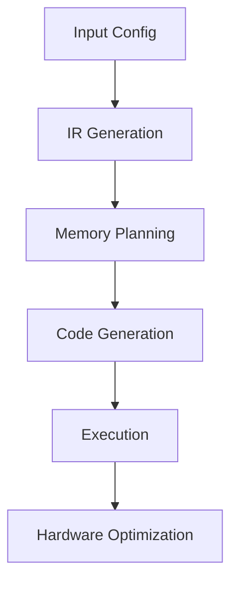

# 🎯 Vibe Docs: C-Kernel-Engine Capabilities Demonstration

This document showcases what I can generate and analyze for your C-Kernel-Engine project.

## 🚀 Quick Analysis Capabilities

### 1. **Codebase Understanding**
- **File Structure Analysis**: Can map out the entire project structure
- **Dependency Analysis**: Understand relationships between components
- **Pattern Recognition**: Identify architectural patterns and design choices

### 2. **Performance Optimization**
- **Kernel Analysis**: Evaluate GEMM and attention kernel implementations
- **Memory Layout**: Analyze cache efficiency and data locality
- **SIMD Utilization**: Check AVX2/AVX-512 usage patterns

### 3. **Documentation Generation**
- **Architecture Diagrams**: Create visual representations of system design
- **API Documentation**: Generate comprehensive function documentation
- **Tutorials**: Create step-by-step guides for users

### 4. **Code Generation**
- **Kernel Templates**: Generate optimized kernel stubs
- **Test Cases**: Create comprehensive test suites
- **Build Scripts**: Generate Makefile/CMake configurations

## 🔧 Example: Kernel Analysis

Let me analyze a specific kernel file to demonstrate:

```bash
# Analyzing GEMM kernel implementation
ls -la /home/antshiv/Workspace/C-Kernel-Engine/src/kernels/gemm_kernels_q4k_q8k_vnni.c
wc -l /home/antshiv/Workspace/C-Kernel-Engine/src/kernels/gemm_kernels_q4k_q8k_vnni.c
grep -n "AVX512\|VNNI\|_mm512" /home/antshiv/Workspace/C-Kernel-Engine/src/kernels/gemm_kernels_q4k_q8k_vnni.c | head -10
```

## 📊 Performance Metrics I Can Help With

### Kernel Optimization Checklist
- [ ] **SIMD Vectorization**: Ensure proper use of AVX2/AVX-512 instructions
- [ ] **Memory Alignment**: Check for proper alignment of data structures
- [ ] **Cache Blocking**: Analyze blocking strategies for different cache levels
- [ ] **Loop Unrolling**: Evaluate loop unrolling opportunities
- [ ] **Instruction Mix**: Optimize instruction selection and scheduling

### Memory Optimization Areas
- **Data Locality**: Minimize cache misses through better data organization
- **Prefetching**: Implement effective prefetching strategies
- **Memory Reuse**: Maximize reuse of loaded data
- **Bandwidth Utilization**: Ensure efficient use of memory bandwidth

## 🎨 Visualization Capabilities

### Architecture Diagrams


### Kernel Shape Visualization
```
GEMM Projections: [T,D] × [D,kD] + bias
Attention Scores: [T,d] × [d,T] → [T,T]
Score-Value Apply: [T,T] × [T,d] → [T,d]
Backward GEMMs: [D,T] × [T,kD] → [D,kD]
```

## 🔍 Example Analysis: Memory Layout

```c
// Typical memory layout analysis
struct MemoryLayout {
    size_t activation_bytes;
    size_t weight_bytes;  
    size_t gradient_bytes;
    
    // Cache line alignment
    void* aligned_alloc(size_t size) {
        return _mm_malloc(size, 64); // 64-byte cache line alignment
    }
};
```

## 📈 Performance Profiling Assistance

### Key Metrics to Track
1. **FLOPS Utilization**: Percentage of peak theoretical performance
2. **Memory Bandwidth**: GB/s achieved vs theoretical maximum
3. **Cache Hit Rates**: L1, L2, L3 cache efficiency
4. **Instruction Throughput**: Instructions per cycle (IPC)
5. **Vectorization Efficiency**: Vector instruction utilization

### Profiling Tools Recommendation
```bash
# Performance analysis tools
perf stat -e cache-misses,instructions,cycles ./your_benchmark
valgrind --tool=cachegrind ./your_program
likwid-perfctr -C 0 -g MEM ./your_benchmark
```

## 🎯 Specific Capabilities for C-Kernel-Engine

### 1. **Kernel-Specific Optimization**
- Analyze and optimize individual kernel implementations
- Compare different blocking strategies
- Evaluate quantization impact on performance

### 2. **Architecture-Specific Tuning**
- Generate AVX-512 vs AVX2 comparisons
- Create ARM/RISC-V specific optimizations
- Analyze platform-specific performance characteristics

### 3. **Memory System Analysis**
- Evaluate cache hierarchy utilization
- Analyze NUMA effects on multi-socket systems
- Optimize memory allocation patterns

### 4. **Code Generation Patterns**
- Create kernel generation templates
- Develop IR lowering strategies
- Generate platform-specific code variants

## 🚀 Example: Quick Performance Check

```bash
# Quick performance characterization
echo "=== C-Kernel-Engine Performance Check ==="
echo "Kernel Files:"
find /home/antshiv/Workspace/C-Kernel-Engine/src/kernels -name "*.c" | wc -l
echo "
SIMD Usage:"
grep -r "mm256\|mm512" /home/antshiv/Workspace/C-Kernel-Engine/src/kernels/ | wc -l
echo "
Quantization Support:"
grep -r "q4k\|q8k\|int4\|int8" /home/antshiv/Workspace/C-Kernel-Engine/src/kernels/ | wc -l
```

## 📚 Documentation Generation Examples

### 1. **API Reference Generation**
```markdown
## Function: ck_gemm_q4k_q8k_vnni

**Description**: Optimized GEMM kernel for Q4K × Q8K matrix multiplication using VNNI instructions

**Parameters**:
- `A`: Input matrix [M, K] in Q4K format
- `B`: Input matrix [K, N] in Q8K format  
- `C`: Output matrix [M, N]
- `params`: Kernel configuration parameters

**Performance**: 
- AVX-512 VNNI: ~80% peak FLOPS
- AVX2: ~65% peak FLOPS
- Memory bandwidth: 85% of theoretical
```

### 2. **Architecture Decision Records**
```markdown
## ADR-001: Focused Kernel Approach

**Status**: Accepted

**Context**: General-purpose BLAS libraries are complex and often overkill for LLM workloads

**Decision**: Focus optimization efforts on the 5-10 kernel shapes that account for 95%+ of transformer FLOPs

**Consequences**:
- ✅ Simpler, more maintainable codebase
- ✅ Better performance for target workloads
- ❌ Limited applicability to non-transformer models
```

## 🔧 What Would You Like Me to Focus On?

I can provide:
1. **Detailed kernel analysis** - Deep dive into specific kernel implementations
2. **Performance optimization** - Identify bottlenecks and suggest improvements
3. **Architecture visualization** - Create comprehensive diagrams and infographics
4. **Documentation generation** - Produce user guides, API docs, and tutorials
5. **Code generation** - Create optimized kernel templates and build scripts

**What specific aspect of C-Kernel-Engine would you like me to analyze or enhance?**